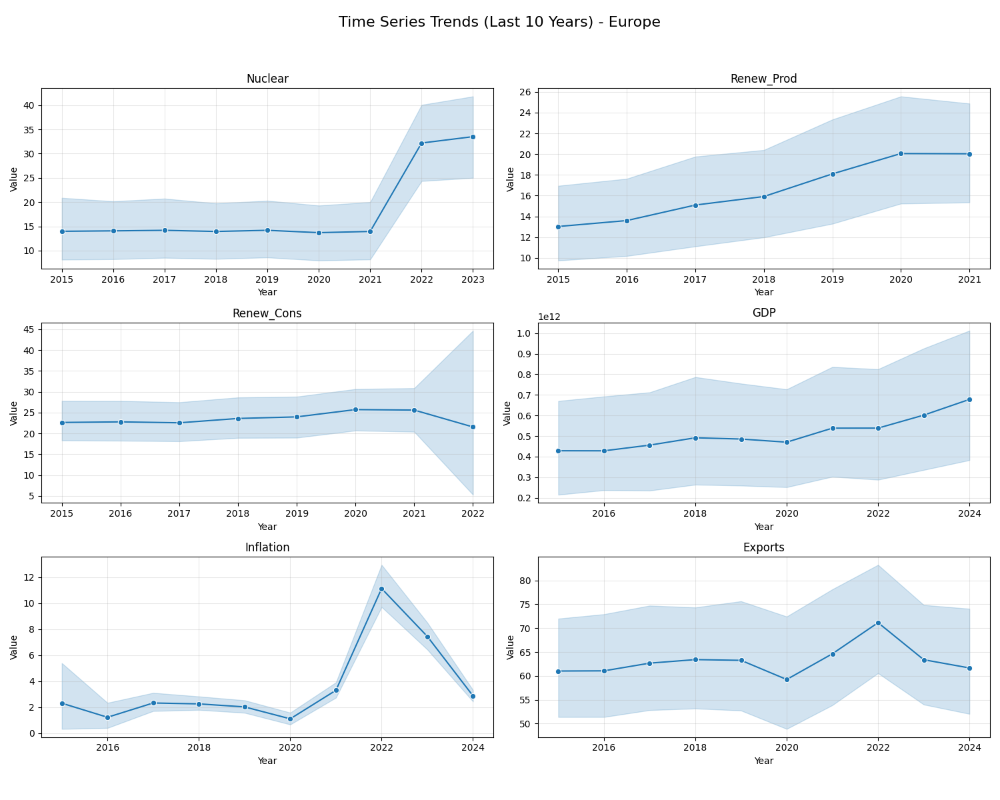

# World Bank Indicators — Statistical & Multivariate Analysis

[](https://github.com/dbechrakis/world-bank-indicators-analysis/actions/workflows/evidence.yml)

A data analytics case study combining **World Bank indicators, statistical analysis, SQL, visualization, outlier detection, and unsupervised learning** to explore economic and energy patterns across countries and regions.

## Executive summary

The analysis works with six indicators:

- GDP
- Inflation
- Exports (% of GDP)
- Nuclear electricity production
- Renewable electricity production
- Renewable energy consumption

The workflow transforms heterogeneous country-level data into an analytical structure and then applies statistical and multivariate methods to investigate regional patterns, relationships, anomalies, and latent structure.

## Analytical questions

- How do economic and energy indicators differ across regions?
- Which observations behave as statistical outliers?
- How are the selected indicators correlated?
- Can unsupervised methods reveal latent indicator groupings?
- How can the cleaned analytical dataset support SQL-based exploration?

## Workflow

```text
World Bank data
      ↓
Cleaning & standardization
      ↓
Long-format analytical dataset
      ↓
EDA & regional aggregation
      ↓
Outlier detection
      ↓
Correlation / covariance analysis
      ↓
NMF & PARAFAC
      ↓
SQLite + SQL analysis
```

## Methods

### Data preparation

- Standardize country names
- Map countries to continents
- Reshape wide-format indicator files into analytical long format
- Export cleaned datasets for downstream analysis

### Statistical analysis

- Regional aggregation
- Decade comparisons
- Correlation and covariance matrices
- Regional Z-score analysis
- IQR-based outlier detection

### Multivariate analysis

- **NMF** for latent indicator structure
- **PARAFAC tensor decomposition** for country × year × indicator patterns

### SQL analytics

Cleaned analytical data is loaded into **SQLite** to support regional and country-level queries.

## Repository structure

```text
world-bank-indicators-analysis/
├── README.md
├── scripts/
│   └── world_bank_analysis.py
├── sql/
│   └── build_database.py
└── data/
    └── raw/
        ├── nuclear_production.csv
        ├── renewable_production.csv
        ├── renewable_consumption.csv
        ├── gdp.csv
        ├── inflation.csv
        └── exports.csv
```

## Reproduction and verified coverage

```bash
pip install -r requirements.txt
python scripts/world_bank_analysis.py
python sql/build_database.py
```

Both scripts were executed against all six committed source files in this review. The database contains **10095 country–indicator–year observations**. [Coverage by indicator](outputs/indicator_coverage.csv) · [Database checks](outputs/validation.json).

The database window is the last ten calendar years relative to the newest observation in the combined data. Individual indicators have different latest years and missingness; this is not a balanced panel. Country averages are unweighted and do not estimate population-weighted regional outcomes.

NMF uses within-indicator median imputation before scaling. PARAFAC masks missing observations rather than treating them as zero. Both decompositions are descriptive and their stability across ranks/imputation choices has not been established.



## Outputs

The analysis generates cleaned datasets, visualizations, analytical outputs, and a project log. Generated artifacts are kept separate from the source analysis code.

## Tech stack

**Python · pandas · NumPy · Matplotlib · scikit-learn · TensorLy · SQLite · SQL · pycountry**

## Interpretation note

The project is intentionally analytical rather than causal. Correlations, regional differences, and latent structures are treated as descriptive evidence and should not be interpreted as causal relationships without additional identification and validation.

## Context

Portfolio data analytics case study developed during an MSc Data Science programme at **The American College of Greece**.

## Author

**Dimitris Bechrakis**  
Business & Data Analyst | M.Sc. Data Science

## Licensing

See [licensing scope](LICENSING.md) for the MIT-licensed verification code and the separately governed project materials.
